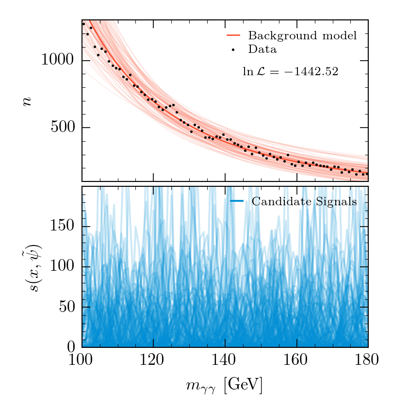

# Discrete Marginal models for particle physics

requires: 
* [anesthetic](https://github.com/williamjameshandley/anesthetic) >=	2.0.0-beta.12
* [PolyChord](https://github.com/PolyChord/PolyChordLite) >= 1.20.1

Example script in `discrete_marginal.py`

Runs the following:
* a fixed background + signal
* a discrete marginalised background + signal
* a discrete marginalised background only (null)

and plots some example metrics, uncomment run lines as needed

Strongly reccomend running with MPI as the sampling code is well parallelised but otherwise can be slow.

